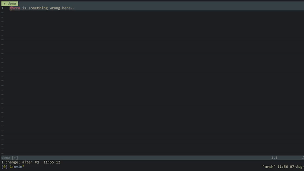

# spellfloat

spellfloat is a Neovim plugin for spelling suggestions from the built-in spell checker.

# Features

- Uses The built-in Vim Spell checker
- Finds the first misspelled word in the Sentence or Takes the Word under the Cursor

# Prerequisites

- You need Neovim for this plugin
- Map the Function `SpellFloat()` to some key

```vim

nnoremap <leader>my :call SpellFloat() <CR>"You can use any other keymap you want

```
- You need to enable spell-checker which can be done by adding the Following lines to your init.vim

```vim

 set spell spelllang=en_us "Choose Any Other Language that you prefer

```
# Installation

```vim

Plug 'aditya-K2/spellfloat'

```

# Usage

Use the Mapping or Call the Function `SpellFloat()` on the line with misspelled word.

If the misspelled is found in the cursor line then a Pop-Up menu with suggestions appears


