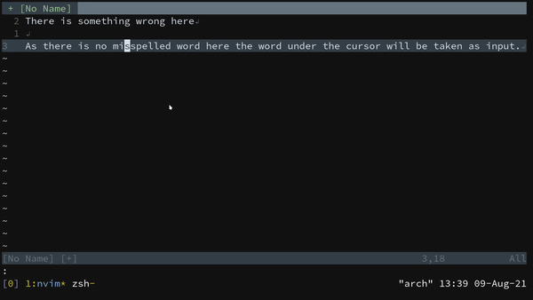

# spellfloat

spellfloat is a Neovim plugin for spelling suggestions from the built-in spell checker.

# Features

- Uses The built-in Vim Spell checker
- Finds the first misspelled word in the Sentence if it finds one then it will suggest Changes through a Pop-Up Menu
- If there is no misspelled word in the Sentence then the suggestions for the word under the cursor is suggested.

# Prerequisites

- You need Neovim for this plugin
- Map the Function `Spellfloat()` to some key

```vim

nnoremap <leader>my :call Spellfloat() <CR> "You can use any other keymap you want

```
- You need to enable spell-checker if you want to check the wrong word in the Sentence

```vim

 set spell spelllang=en_us "Choose Any Other Language that you prefer

 " If you don't turn on the spell-checker then the word under your cursor is taken as input

```
# Installation

```vim

Plug 'aditya-K2/spellfloat'

```

# Usage

Use the Mapping or Call the Function `Spellfloat()` on the line with misspelled word.

If the misspelled word is found in the current line then suggestions for it are displayed else the word under the cursor is taken as input.

## When There is a misspelled word in the current Sentence


## When There is no misspelled word in the current Sentence


